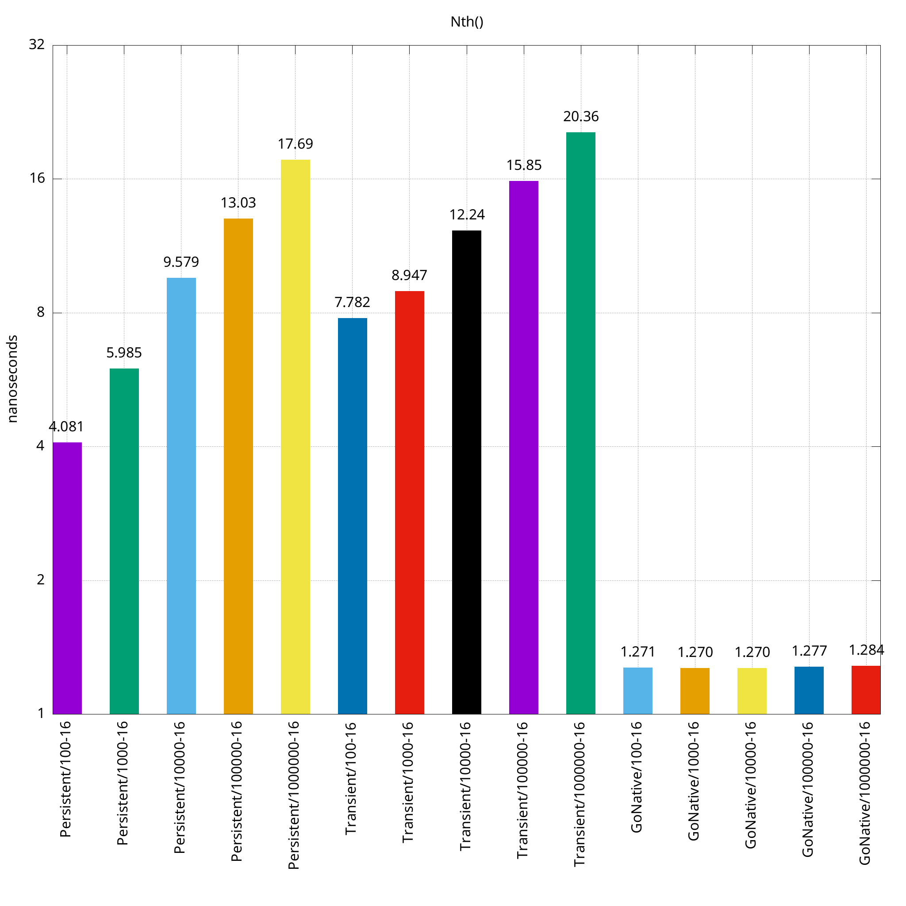

# Persistent

`persistent` is the top-level package for packages which provide
implementations of Clojure's persistent data structures (namely: lists,
vectors, and maps) for Go, using generic types.

## Vectors Benchmarks

The below benchmark graphs were constructed to compare persistent vectors,
transient vectors, and native GO arrays. They are displayed with a logarithmic
scale, and each graph is named after the operation being performed. The X axis
is labeled with the name of the structure performing the operation the graph is
named after, with a number following it indicating the size of the structure
the operation is being performed on. The second number in the x-axis label is
the number of threads used during the benchmark.

So a label like "Persistent/100-12" means it was a persistent vector on a 100
item vector on a 12 thread machine.

## For Developers
This section is intended as guidance for developers and contributors to this
project.
### Update package version
Simply run `./version.sh increment` and follow the prompts. The VERSION.txt
file will be updated and comitted to  Git automatically. After the commit, a
tag using the incremented version number is created.
### Publishing package version
After updating the version locally with `./version.sh increment`, the new version
can be published with `./version.sh publish`. This pushes the Git tag which matches
the current VERSION.txt file and publishes documentation to pkg.go.dev.
