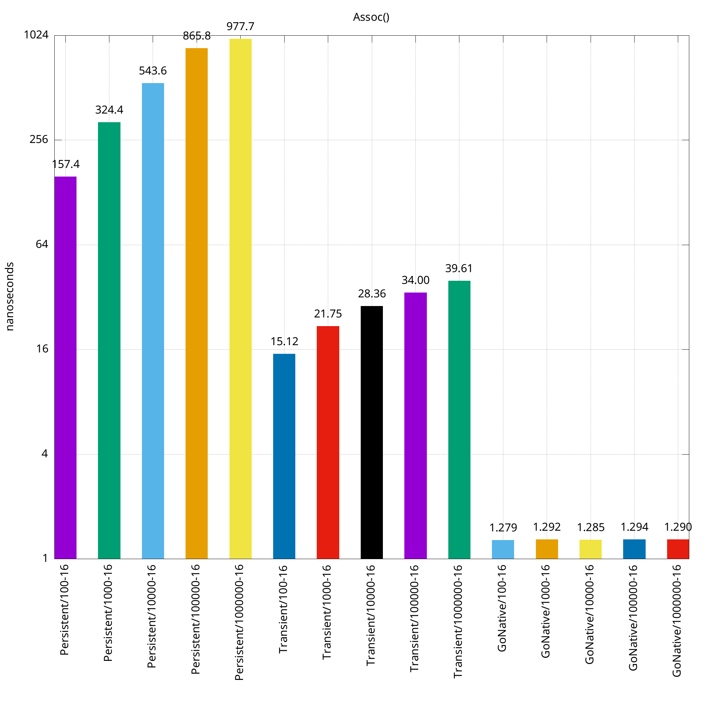
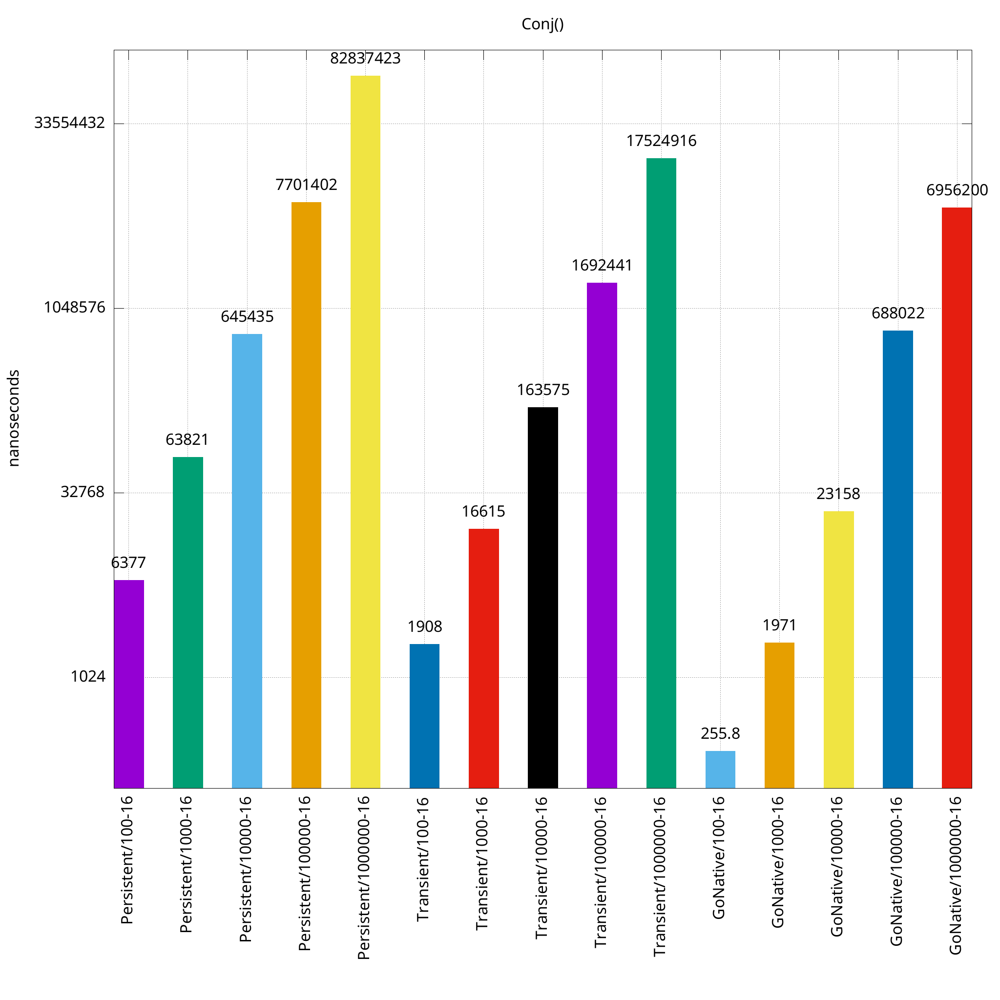

# Persistent

`persistent` is the top-level package for packages which provide
implementations of Clojure's persistent data structures (namely: lists,
vectors, and maps) for Go, using generic types.

## Package Progress

The below is the roadmap and currently implementation status of planned
features. A feature is considered done if the implementation is written with
adequate unit test coverage:

- [X] Lists
	- [X] Functions:
		- [X] New(): Creates a new list
	- [X] Methods:
		- [X] Conj(e): Creates a new list with item e prepended to the head
		- [X] First(): Return the item from the head of the list
		- [X] Len(): Returns the number of items in the list
		- [X] Rest(): Returns a list of items containing all but the first value of the list
		- [X] Pop(): Creates a new list without the first item
		- [X] String(): Creates a string representation of the list
- [ ] Vectors:
	- [ ] Persistent:
		- [ ] Functions:
			- [X] New(): Creates a new vector
			- [X] Transient(v): Creates a new transient vector from v
			- [ ] Subvec(v, i, j): Creates a new vector from a subset of items in v from i (inclusive) to j (exclusive)
		- [ ] Methods:
			- [X] Assoc(i, e): Creates a new vector with index i updated to item e.
			- [X] Conj(e): Creates a new vector with e appended to the end
			- [X] Len(): Returns the number of items in the vector
			- [X] Nth(n): Returns the item at index n from the vector
			- [X] Peek(): Returns the last item of the vector
			- [ ] Pop(): Returns a new vector with the last item removed
			- [X] String(): Creates a string representation of the vector
	- [ ] Transient:
		- [ ] Functions:
			- [X] Persistent(v): Creates a new persistent vector from v
			- [ ] Subvec(v, i, j): Creates a new vector from a subset of items in v from i (inclusive) to j (exclusive)
		- [ ] Methods:
			- [X] Assoc(i, e): Creates a new vector with index i updated to item e.
			- [X] Conj(v): Creates a new vector with v appended to the end
			- [X] Len(): Returns the number of items in the vector
			- [X] Nth(n): Returns the item at index n from the vector
			- [X] Peek(): Returns the last item of the vector
			- [ ] Pop(): Returns a new vector with the last item removed
			- [X] String(): Creates a string representation of the vector
- [ ] Maps
	- [ ] Persistent:
		- [ ] Functions:
			- [ ] New(): Creates a new map
		- Methods:
			- [ ] Assoc(k, e): Creates a new map with key k associated to item e.
			- [ ] Len(): Returns the number of items in the map
			- [ ] Get(k): Returns the item associated with k from the map
			- [ ] Peek(): Returns the last item of the map
			- [ ] Pop(): Returns a new map with the last item removed
			- [ ] String(): Creates a string representation of the map
	- [ ] Transient:
			- [ ] Assoc(k, e): Creates a new map with key k associated to item e.
			- [ ] Len(): Returns the number of items in the map
			- [ ] Get(k): Returns the item associated with k from the map
			- [ ] Peek(): Returns the last item of the map
			- [ ] Pop(): Returns a new map with the last item removed
			- [ ] String(): Creates a string representation of the map

## Vectors Benchmarks

The below benchmark graphs were constructed to compare persistent vectors,
transient vectors, and native GO arrays. They are displayed with a logarithmic
scale, and each graph is named after the operation being performed. The X axis
is labeled with the name of the structure performing the operation the graph is
named after, with a number following it indicating the size of the structure
the operation is being performed on. The second number in the x-axis label is
the number of threads used during the benchmark.

So a label like "Persistent/100-12" means it was a persistent vector on a 100
item vector on a 12 thread machine.

## For Developers

This section is intended as guidance for developers and contributors to this
project.

### Update package version

Simply run `./version.sh increment` and follow the prompts. The VERSION.txt
file will be updated and committed to  Git automatically. After the commit, a
tag using the incremented version number is created.

### Publishing package version

After updating the version locally with `./version.sh increment`, the new version
can be published with `./version.sh publish`. This pushes the Git tag which matches
the current VERSION.txt file and publishes documentation to pkg.go.dev.
